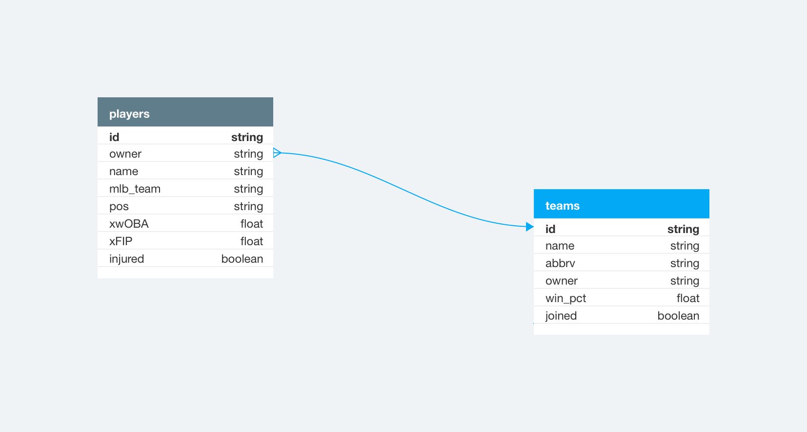

# Relational Rails

Exploration of Rails framework with simple database relationships.
Project 1 -- Mod 2 -- Backend -- Turing

## User Stories

### Iteration 1

#### CRUD

 - [x] User Story 1, Team Index
   - For the team table 
     As a league manager 
     When I visit '/teams' 
     Then I see the name of each team record in the system 
 - [x] User Story 2, Team Show
   - As a league manager 
     When I visit '/teams/:id' 
     Then I see the team with that id including the team's attributes 
     (data from each column that is on the team table)
 - [x] User Story 3, Player Index 
   - As a league manager 
     When I visit '/players' 
     Then I see each Player in the system including the Player's attributes 
     (data from each column that is on the player table)
 - [x] User Story 4, Player Show 
   - As a league manager 
     When I visit '/players/:id' 
     Then I see the player with that id including the player's attributes 
     (data from each column that is on the player table)
 - [x] User Story 5, Team Player Index
   - As a league manager 
     When I visit '/teams/:team_id/players' 
     Then I see each Player that is associated with that Team with each Player's attributes 
     (data from each column that is on the player table)

#### ActiveRecord

 - [x] User Story 6, Team Index sorted by Most Recently Created 
   - As a league manager 
     When I visit the team index, 
     I see that records are ordered by most recently created first 
     And next to each of the records I see when it was created 
 - [x] User Story 7, Team Player Count
   - As a league manager 
     When I visit a team's show page 
     I see a count of the number of players associated with this team 

#### Usability

 - [x] User Story 8, Player Index Link
   - As a league manager 
     When I visit any page on the site 
     Then I see a link at the top of the page that takes me to the Player Index 
 - [x] User Story 9, Team Index Link
   - As a league manager 
     When I visit any page on the site 
     Then I see a link at the top of the page that takes me to the Team Index 
 - [x] User Story 10, Team Player Index Link
   - As a league manager 
     When I visit a team show page ('/teams/:id') 
     Then I see a link to take me to that team's `player` page ('/teams/:id/players')

### Iteration 2

#### CRUD
- [x] User Story 11, Team Creation
  - As a league manager 
    When I visit the Team Index page 
    Then I see a link to create a new Team record, "New Team" 
    When I click this link 
    Then I am taken to '/teams/new' where I  see a form for a new team record 
    When I fill out the form with a new team's attributes: 
    And I click the button "Create Team" to submit the form 
    Then a `POST` request is sent to the '/teams' route,
    a new team record is created,
    and I am redirected to the Team Index page where I see the new Team displayed.
- [x] User Story 12, Team Update
  - As a league manager 
    When I visit a team show page 
    Then I see a link to update the team "Update Team" 
    When I click the link "Update Team" 
    Then I am taken to '/teams/:id/edit' where I  see a form to edit the team's attributes: 
    When I fill out the form with updated information 
    And I click the button to submit the form 
    Then a `PATCH` request is sent to '/teams/:id',
    the team's info is updated,
    and I am redirected to the Team's Show page where I see the team's updated info
- [x] User Story 13, Team Player Creation
  - As a league manager 
    When I visit a Team Children Index page 
    Then I see a link to add a new adoptable player for that team "Create Player" 
    When I click the link 
    I am taken to '/teams/:team_id/players/new' where I see a form to add a new adoptable player 
    When I fill in the form with the player's attributes: 
    And I click the button "Create Player" 
    Then a `POST` request is sent to '/teams/:team_id/players',
    a new player object/row is created for that team,
    and I am redirected to the Team Players Index page where I can see the new player listed
- [x] User Story 14, Player Update
  - As a league manager
    When I visit a Player Show page 
    Then I see a link to update that Player "Update Player" 
    When I click the link 
    I am taken to '/players/:id/edit' where I see a form to edit the player's attributes: 
    When I click the button to submit the form "Update Player" 
    Then a `PATCH` request is sent to '/players/:id',
    the player's data is updated,
    and I am redirected to the Player Show page where I see the Player's updated information

#### ActiveRecord

- [ ] User Story 15, Player Index only shows `true` Records
  - As a league manager 
    When I visit the player index 
    Then I only see records where the boolean column is `false` 
- [ ] User Story 16, Sort Team's Children in Alphabetical Order by name
  - As a league manager 
    When I visit the Team's players Index Page 
    Then I see a link to sort players in alphabetical order 
    When I click on the link 
    I'm taken back to the Team's players Index Page where I see all of the team's players in alphabetical order

#### Usability

- [ ] User Story 17, Team Update From Team Index Page
  - As a league manager 
    When I visit the team index page 
    Next to every team, I see a link to edit that team's info 
    When I click the link 
    I should be taken to that team's edit page where I can update its information just like in User Story 12
- [ ] User Story 18, Player Update From Players Index Page
  - As a league manager 
    When I visit the `child_table_name` index page or a team `child_table_name` index page 
    Next to every player, I see a link to edit that player's info 
    When I click the link 
    I should be taken to that `child_table_name` edit page where I can update its information just like in User Story 14